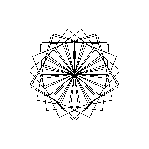
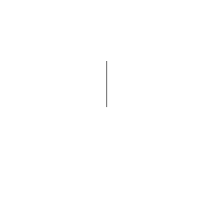

# embedded example

This directory contains a simple example program which executes a user-supplied
TCL script, to generate graphics.

The core of the application creates a graphics area to draw upon, and exports
some primitives to the users' script:

* move x y
  * Move the pen to X,Y coordinate
* pen 0|1
  * Move the pen up/down
* turn angle
  * Turn the pen to the given angle
* forwards N
  * Move the pen forward N steps


Together these allow drawing very simple shapes, for example:

```tcl
    proc square {x y length} {
        move x,y
        pen 1
        forwards $length
        turn 90
        forwards $length
        turn 90
        forwards $length
        turn 90
        forwards $length
    }

    square 50 50 25
```


## Sample Output

Running the simple example `squares.tcl` you receive this output:



This is built up like so:




## Alternative Example

I wrote a toy FORTH-like interpreter in the past:

* https://github.com/skx/foth

That has the same sample program, demonstrating how it could be embedded:

* https://github.com/skx/turtle
